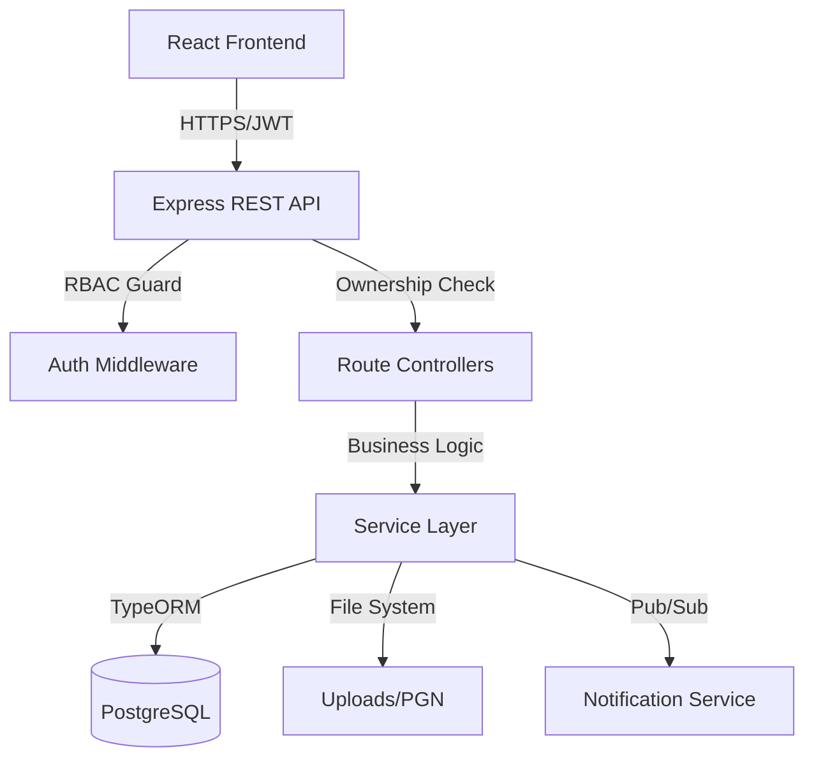

# ♟ Chess Masterclass & Coaching Arena

A high-performance, role-based full-stack platform designed to bridge the gap between passive chess learning and elite cohort-based coaching. This platform empowers coaches to host structured, capacity-limited masterclasses while providing students with a mentor-led environment for systematic improvement.

---

## 🚀 Key Technical Features

### 🔐 Enterprise-Grade Security & RBAC

- **JWT-Based Authentication**: Stateless authentication using JSON Web Tokens with role-encoded payloads.
- **Strict Authorization Guards**: Multi-level RBAC middleware enforcing permissions at both the API and UI layers.
- **Ownership Enforcement**: Programmatic checks (e.g., `coach_id === req.user.userId`) preventing unauthorized resource manipulation.
- **Safe Transactions**: ACID-compliant database transactions for enrollment to prevent race conditions in capacity management.

### 🔍 Advanced Search & Discovery

- **Dynamic Query Engine**: Built with TypeORM `QueryBuilder` supporting complex multi-parameter filtering.
- **Filtering Options**: Search by keyword, category (Opening, Middlegame, Endgame, Tactics), coach name, and date range.
- **Availability Intelligence**: Real-time filtering to exclude full classes or past sessions from discovery results.
- **Pagination & Sorting**: Performance-optimized data fetching with customizable sort orders.

### 📊 Coach Analytics & Insights

- **Performance Metrics**: Real-time tracking of enrollment trends, fill rates, and class popularity.
- **Data Visualization**: Interactive dashboards powered by `Chart.js` showing category distributions and daily enrollment growth.
- **Student Management**: Detailed roster views with the ability to manage active and waitlisted students.

### 🛠️ Advanced Masterclass Management

- **Rich Media Support**: Integrated file uploads for PGN (chess notation) and board images via `Multer`.
- **Material Registry**: Dedicated system for managing class-specific resources (Videos, Articles, Documents, Links).
- **Waitlist Ecosystem**: Automated FIFO (First-In-First-Out) promotion logic that elevates waitlisted students when spots open.
- **Kick & Moderation**: Structured "Kick Request" workflow for coaches, requiring admin approval to maintain platform integrity.

### 🔔 In-App Engagement System

- **Real-time Notifications**: Automated alerts for new classes from favorite coaches, material updates, and enrollment status changes.
- **Engagement Tools**: Bookmarking system for classes and "Favorite Coach" tracking for students.
- **Review & Feedback**: Post-session star ratings and written reviews to build instructor credibility.

---

## 🛠️ Technology Stack

| Component    | Technology              | Rationale                                                             |
| :----------- | :---------------------- | :-------------------------------------------------------------------- |
| **Frontend** | **React 19 + Vite**     | Modern, fast, and component-driven architecture.                      |
| **Styling**  | **Tailwind CSS 4**      | Rapid, utility-first design with a consistent professional aesthetic. |
| **Backend**  | **Node.js + Express 5** | Scalable and modular REST API architecture.                           |
| **Database** | **PostgreSQL**          | Relational integrity and complex querying capabilities.               |
| **ORM**      | **TypeORM**             | Programmatic schema management and advanced QueryBuilder.             |
| **Cache**    | **Redis**               | (Optional) High-speed caching for frequent read operations.           |
| **State**    | **React Context API**   | Lightweight global state management for auth and user profiles.       |
| **Auth**     | **JWT + bcrypt**        | Secure, stateless authentication and salted password hashing.         |

---

## 🏗️ Architecture Overview



---

## 🗄️ Database Schema

The system utilizes a highly relational schema managed programmatically via TypeORM entities:

- **Users**: Core identity table with role differentiation (`admin`, `coach`, `player`).
- **Masterclasses**: The primary business entity storing session metadata, capacity, and coach ownership.
- **Enrollments**: Join entity managing the many-to-many relationship between players and classes with `active`/`waitlisted` statuses.
- **Class Materials**: Hierarchical storage for resources linked to specific masterclasses.
- **Notifications**: Persistent storage for user alerts and engagement triggers.
- **Reviews**: Feedback registry for class ratings and student testimonials.
- **Kick Requests**: Moderation entity for managing coach-student conflicts.

---

## 🚦 Getting Started

### Prerequisites

- Node.js 20+
- PostgreSQL 15+
- Redis (Optional for caching)

### 1. Installation

```bash
# Clone the repository
git clone https://github.com/your-username/chess-arena.git
cd chess-arena

# Install dependencies
cd server && npm install
cd ../client && npm install
```

### 2. Configuration

Create a `.env` file in the `server` directory:

```env
PORT=5000
DB_HOST=localhost
DB_PORT=5432
DB_USERNAME=postgres
DB_PASSWORD=your_password
DB_NAME=chess_arena
JWT_SECRET=your_32_char_secret
CLIENT_URL=http://localhost:5173
```

### 3. Execution

```bash
# Terminal 1: Backend
cd server
npm run dev

# Terminal 2: Frontend
cd client
npm run dev
```

---

## 📖 API Documentation (Summary)

| Path                 | Method | Access | Description                         |
| :------------------- | :----- | :----- | :---------------------------------- |
| `/api/auth`          | `POST` | Public | Registration & JWT Login            |
| `/api/masterclasses` | `GET`  | Public | Advanced search & discovery         |
| `/api/masterclasses` | `POST` | Coach  | Create new masterclass (Multi-part) |
| `/api/enrollments`   | `POST` | Player | Transactional enrollment/waitlist   |
| `/api/materials`     | `POST` | Coach  | Manage class resources              |
| `/api/analytics`     | `GET`  | Coach  | Personal performance metrics        |
| `/api/admin`         | `PUT`  | Admin  | Coach approval & kick moderation    |

---

## 📜 License

This project is licensed under the MIT License.
