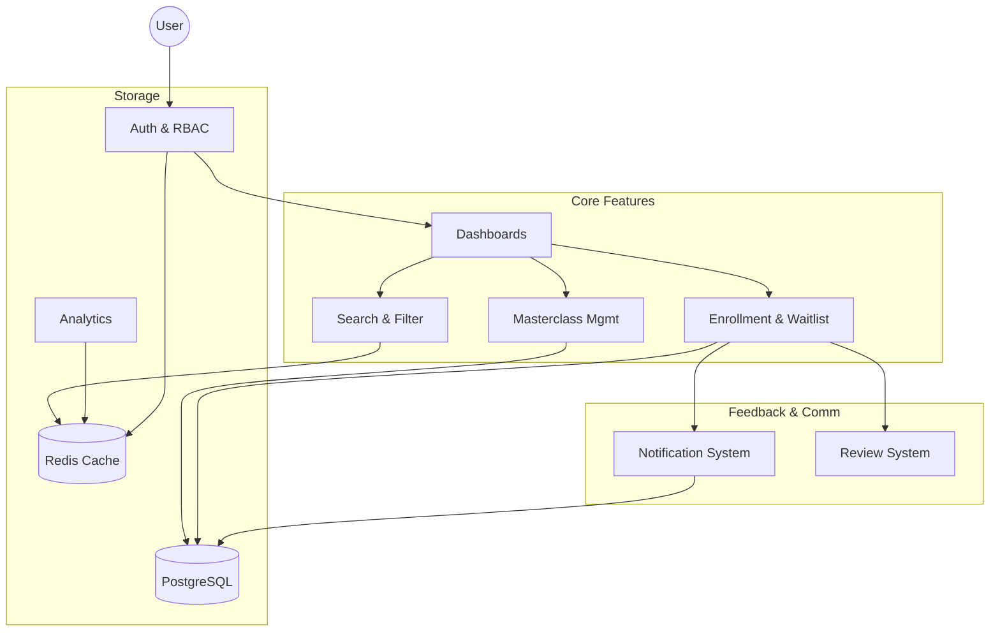

# Project Documentation Index

Welcome to the **Chess Masterclass & Coaching Arena** documentation. This folder contains a comprehensive guide to the platform's architecture, business logic, and feature implementation.

## System Overview

The following diagram illustrates the high-level relationship between the core components of the platform:

## Detailed Documentation

| 📑 **[Project Report](project_report.md)** | Full problem statement, target users, and system overview. | General Info |
| 📋 **[Technical Req](technical_requirements.md)** | Mandatory stack, structural rules, and project constraints. | Compliance |
| 🤖 **[AI Usage](../ai_usage.md)** | Quantification of AI assistance (Total: 24.0%). | Declaration |
| 🔐 **[Auth & RBAC](auth_rbac.md)** | Security architecture, JWT flow, and role-based permissions. | `auth.service`, `roleGuard` |
| 🎓 **[Masterclass Mgmt](masterclass_management.md)** | Content creation, media uploads (PGN/Images), and session lifecycle. | `Masterclass.ts`, `Multer` |
| 🔍 **[Search & Filter](search_filter.md)** | Advanced discovery engine with dynamic SQL filtering and pagination. | `QueryBuilder`, `Redis` |
| 🎟️ **[Enrollment System](enrollment_system.md)** | Transactional joining, FIFO waitlisting, and kick-request workflows. | `AppDataSource.transaction` |
| 🔔 **[Notification System](notification_system.md)** | Persistent in-app alerts and automated business event triggers. | `Notification.ts` |
| 📊 **[Analytics Dashboards](analytics_dashboards.md)** | Data aggregation and visualization for different user roles. | `Chart.js`, `SQL Aggs` |
| ⭐ **[Review System](review_system.md)** | Player feedback loops and coach reputation management. | `Review.ts` |

---

## Technical Stack Summary

### Backend
- **Framework**: Node.js / Express
- **Language**: TypeScript
- **Database**: PostgreSQL (Relational)
- **ORM**: TypeORM
- **Authentication**: JWT / Bcrypt
- **File Handling**: Multer

### Frontend
- **Library**: ReactJS
- **Styling**: Tailwind CSS / Bootstrap
- **State Management**: Context API / Axios
- **Visualization**: Chart.js

### Infrastructure
- **Caching**: Redis
- **Task Scheduling**: (Planned) BullMQ for reminders
