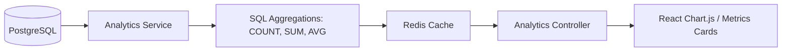

# Analytics & Dashboards

## Overview
The platform provides data-driven dashboards tailored to each user role. These dashboards convert raw database records into meaningful insights about platform health, coach performance, and student engagement.

## Data Flow & Aggregation

Dashboards use specialized aggregation services to fetch data without loading thousands of individual records.



## Dashboard Components

### 1. Admin Dashboard (Global Metrics)
Designed for platform oversight and growth monitoring.
- **Key Metrics**:
  - `Total Users`: Count grouped by role.
  - `Revenue Approximation`: (If applicable) Sum of enrollment values.
  - `Conversion Rate`: Active Enrollments vs. Total Browse Views.
- **Control Panel**: Pending coach approvals and platform-wide class moderation.

### 2. Coach Dashboard (Personal Performance)
Focuses on class management and student retention.
- **Seat Utilization**:
  ```sql
  SELECT (SUM(enrolled_count) / SUM(capacity)) * 100 as utilization
  FROM masterclasses WHERE coach_id = :id
  ```
- **Student Roster**: Active students per class with waitlist positions.
- **Top Categories**: Identifying which chess topics (e.g., Openings vs. Tactics) attract the most students.

### 3. Player Dashboard (Personal Progress)
Tracks learning history and upcoming commitments.
- **Enrolled Timeline**: Chronological view of upcoming sessions.
- **Waitlist Status**: Real-time position in various queues.
- **Learning Breadth**: Breakdown of classes attended by category (e.g., "60% Endgame, 40% Tactics").

## Implementation Details

### SQL Aggregation Logic
We use TypeORM's `QueryBuilder` for complex joins and aggregations to ensure performance:
```typescript
const stats = await masterclassRepo.createQueryBuilder('mc')
    .select('mc.category', 'category')
    .addSelect('COUNT(e.id)', 'enrollmentCount')
    .leftJoin('mc.enrollments', 'e')
    .groupBy('mc.category')
    .getRawMany();
```

### Visualizations
- **Charts**: Integration with `Chart.js` for time-series data (e.g., "Enrollments over the last 30 days").
- **Metric Cards**: High-impact "Big Numbers" for quick status checks.

## Performance Optimization
- **Redis Caching**: Dashboard aggregation results are cached in Redis for **1 hour**. This prevents repeated expensive SQL calculations for static metrics.
- **Materialized Views**: (Planned) For very large datasets, we plan to use PostgreSQL Materialized Views to pre-calculate daily statistics.
- **Conditional Fetching**: Dashboards only fetch data for the specific tabs the user is viewing to minimize API payload sizes.
