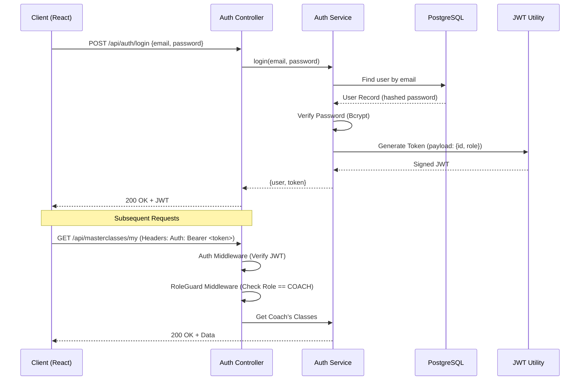

# Authentication & Role-Based Access Control (RBAC)

## Overview
The Chess Masterclass & Coaching Arena utilizes a robust, stateless authentication architecture powered by JSON Web Tokens (JWT). This ensures secure, scalable communication between the React frontend and the Express backend while strictly enforcing Role-Based Access Control (RBAC) at the API layer.

## Authentication Workflow

The following sequence diagram illustrates the login process and how subsequent authenticated requests are handled:



## Implementation Details

### 1. Token Architecture
- **Payload Structure**: The JWT contains minimal non-sensitive data:
  ```json
  {
    "id": "uuid-v4",
    "role": "coach",
    "iat": 1714550000,
    "exp": 1714636400
  }
  ```
- **Expiration**: Set to 24 hours to balance security with user convenience.
- **Security**: Signed using a server-side `JWT_SECRET`. Password hashing is performed using `bcryptjs` with a cost factor of 10.

### 2. RBAC Middleware Chain
Access control is enforced through a layered middleware approach:

1.  **`authenticate`**:
    - Extracts the token from the `Authorization` header.
    - Decodes and verifies the signature.
    - Attaches the decoded user object to `req.user`.
2.  **`authorize(...roles)`**:
    - Checks if `req.user.role` is included in the allowed roles for the route.
    - Returns `403 Forbidden` if the role is insufficient.

```typescript
// Example: Restricting a route to Admins and Coaches
router.post('/create', authenticate, authorize(UserRole.ADMIN, UserRole.COACH), controller.create);
```

## Role Definitions & Permissions

| Feature | Player | Coach | Admin |
| :--- | :---: | :---: | :---: |
| Browse Masterclasses | ✅ | ✅ | ✅ |
| Enroll in Class | ✅ | ❌ | ❌ |
| Create Masterclass | ❌ | ✅ (if approved) | ✅ |
| Edit Own Classes | ❌ | ✅ | ✅ |
| Approve Coaches | ❌ | ❌ | ✅ |
| Analytics (Global) | ❌ | ❌ | ✅ |
| Analytics (Personal)| ❌ | ✅ | ❌ |

## Security Best Practices Implemented
- **Password Salting**: Unique salt per user via Bcrypt.
- **Role Invariants**: Roles are checked at the server level; frontend role-checks are purely for UI/UX.
- **Statelessness**: The server does not store session data, facilitating horizontal scaling.
- **Fail-Safe**: Routes are protected by default; permissions must be explicitly granted via `authorize`.
- **Permission Caching**: User roles and approval statuses are cached in **Redis** for 1 hour. This eliminates a database hit on every protected API call. The cache is automatically invalidated if an admin updates the user's status.
