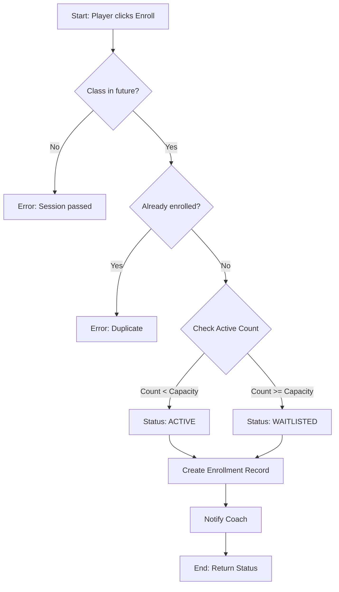
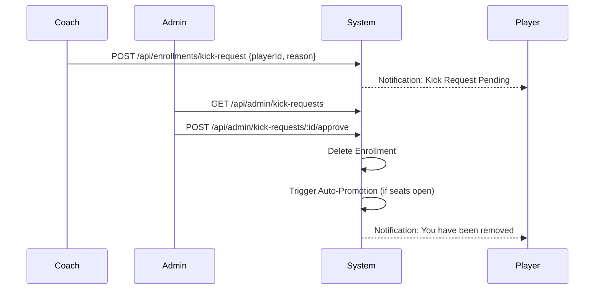

# Enrollment System & Waitlisting

## Overview
The Enrollment System manages the complex relationship between players and coaching sessions. It is designed to handle high-concurrency enrollment attempts while maintaining strict capacity limits and fair waitlist ordering.

## Enrollment Process Flow

The following flowchart details the logic used when a player attempts to join a class:



## Implementation Details

### 1. Database Transactions
To prevent "race conditions" where two players might claim the last remaining seat simultaneously, the enrollment logic is wrapped in a database transaction:
```typescript
await AppDataSource.transaction(async (transactionalEntityManager) => {
    // 1. Lock class row / Check current count
    // 2. Insert enrollment
    // 3. Update cached counts if necessary
});
```

### 2. Waitlist Management (FIFO)
- **Ordering**: The waitlist strictly follows a **First-In-First-Out (FIFO)** strategy based on the `enrolled_at` timestamp.
- **Queue Position**: Calculated dynamically using a SQL subquery:
  ```sql
  SELECT COUNT(*) + 1 FROM enrollments 
  WHERE masterclass_id = :id AND status = 'waitlisted' AND enrolled_at < :my_timestamp
  ```

### 3. Auto-Promotion Logic
When a confirmed student cancels their enrollment, the system automatically processes the waitlist:
1.  **Deletion**: Remove the cancelling student's record.
2.  **Selection**: Fetch the earliest waitlisted record for that class.
3.  **Promotion**: Update status from `WAITLISTED` to `ACTIVE`.
4.  **Notification**: Trigger a `NotificationType.WAITLIST_PROMOTED` to the newly active player.

## Kick Request & Moderation
Coaches can initiate a student removal process to ensure a healthy learning environment.



## Business Rules Summary

- **Self-Enrollment Guard**: Coaches cannot enroll in their own sessions.
- **Status Persistence**: Once a player is waitlisted, their position is fixed relative to others who joined later.
- **Admin Override**: Only Admins can process Kick Requests, preventing potential abuse of power by coaches.
- **Email Notifications**: (Planned) Integration with Nodemailer to provide off-platform alerts for waitlist promotions.
