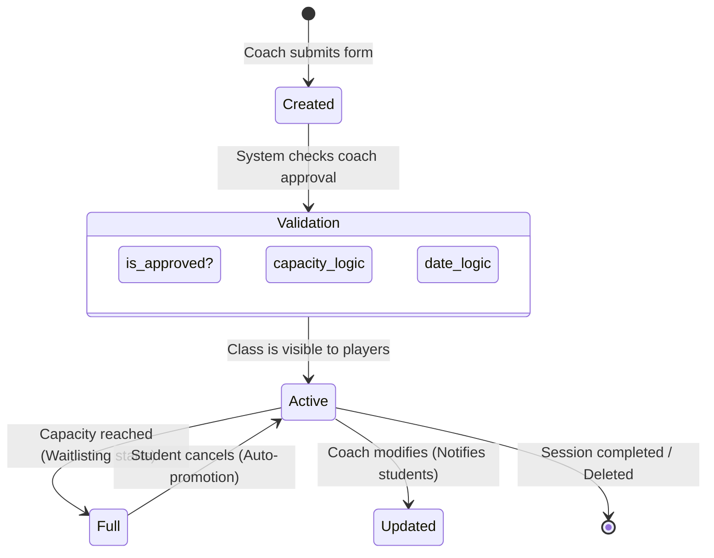

# Masterclass Management

## Overview
The Masterclass system is the heart of the Coaching Arena. It enables coaches to digitize their expertise through structured, capacity-limited sessions. The system handles everything from rich-media content management to session scheduling and automated student communication.

## Masterclass Lifecycle

A Masterclass undergoes several state transitions and validation checks during its existence:



## Technical Implementation

### 1. Data Model
The `Masterclass` entity is linked to:
- **User (Coach)**: Mandatory many-to-one relationship.
- **Enrollments**: One-to-many relationship tracking students.
- **ClassMaterials**: One-to-many relationship for PGNs and board images.

### 2. Media & Content Handling
We support rich chess content via a dedicated material management service:
- **Multer Configuration**:
  ```typescript
  const storage = multer.diskStorage({
      destination: 'uploads/',
      filename: (req, file, cb) => cb(null, `${Date.now()}-${file.originalname}`)
  });
  ```
- **Validation**: Strict MIME-type checking for images (`image/jpeg`, `image/png`) and chess notation files (`application/x-chess-pgn`).
- **Storage Strategy**: Files are served via static middleware in Express, with URLs stored in the database.

### 3. Ownership & Security
Every mutating operation (update/delete) is protected by an ownership guard:
```typescript
if (masterclass.coach_id !== authenticatedUserId) {
    throw new ForbiddenError("You do not have permission to modify this class.");
}
```

## Business Logic Rules

### Creation Constraints
- Only **Approved Coaches** can create classes. This is a platform-wide quality control measure.
- **Past Dates**: The system prevents scheduling classes in the past.

### Update Integrity
- **Capacity Floor**: Coaches cannot reduce capacity below the current number of active enrollments.
- **Automated Sync**: Updating the `session_date` or `title` triggers an automated `NotificationType.CLASS_UPDATE` to all enrolled students.

### Deletion Safety
- **Active Student Guard**: To prevent disruption, a coach cannot delete a class if it has active enrollments. They must either manually cancel enrollments (notifying students) or contact an Admin for a forced override.

## API Endpoints Summary

| Method | Endpoint | Access | Description |
| :--- | :--- | :--- | :--- |
| `GET` | `/api/masterclasses` | Public | List with search/filter/pagination |
| `POST` | `/api/masterclasses` | Coach | Create new masterclass + upload media |
| `GET` | `/api/masterclasses/:id` | Public | Detailed view with enrollment stats |
| `PATCH` | `/api/masterclasses/:id` | Coach (Owner) | Update details (triggers notifications) |
| `DELETE`| `/api/masterclasses/:id` | Coach (Owner) | Delete if empty |
