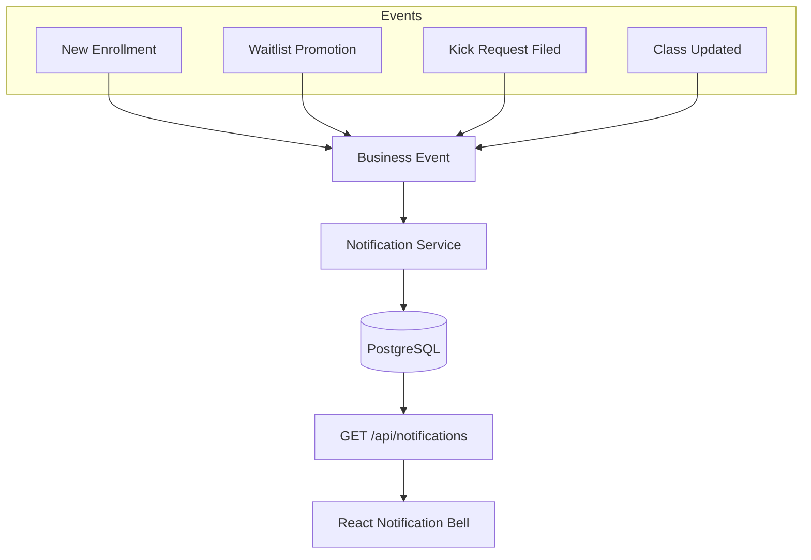

# Notification System

## Overview
The Notification System is the primary engine for user engagement and platform transparency. It provides persistent, real-time alerts for critical business events, ensuring that users never miss an enrollment update or a scheduled session.

## System Architecture

The system follows an "Observer" pattern where various services trigger notifications during their execution.



## Implementation Details

### 1. Persistence Layer
Notifications are stored in the database to ensure they survive sessions and page refreshes.
- **Entity**: `Notification`
  - `user_id`: Target recipient.
  - `type`: Enum (e.g., `ENROLLMENT_NEW`, `WAITLIST_PROMOTED`).
  - `title` & `message`: Display text.
  - `is_read`: Boolean status for unread counts.

### 2. Centralized Service
All notifications are dispatched through a single service to maintain consistency:
```typescript
export const createNotification = async (data: {
  user_id: string;
  type: NotificationType;
  title: string;
  message: string;
}) => {
  const notif = notifRepo.create(data);
  return await notifRepo.save(notif);
};
```

## Notification Triggers & Logic

| Event | Recipient | Type | Content Summary |
| :--- | :--- | :--- | :--- |
| **New Enrollment** | Coach | `ENROLLMENT_NEW` | "Student [Name] joined [Class Title]" |
| **Waitlist Promotion**| Player | `WAITLIST_PROMOTED` | "You got a seat! You are now active in [Class Title]" |
| **Kick Request** | Player | `KICK_REQUEST_PENDING`| "A removal request has been filed for [Class Title]" |
| **Class Update** | Student | `CLASS_UPDATE` | "Details for [Class Title] have changed" |
| **Coach Approved** | Coach | `COACH_APPROVED` | "Your account is now approved! You can start teaching." |

## User Experience Features
- **Unread Badge**: The frontend displays a numeric badge on the notification bell, updated via a lightweight `/api/notifications/unread-count` endpoint.
- **Mark All as Read**: A convenience feature to clear all alerts at once.
- **Deep Linking**: (Planned) Notifications will include a `link_url` to take the user directly to the relevant Masterclass or Dashboard page.

## Real-time Strategy
Currently, the system uses **Short Polling** (the frontend fetches new notifications every 60 seconds or upon specific user actions). Future iterations plan to implement **WebSockets (Socket.io)** for instantaneous delivery of critical alerts like waitlist promotions.
