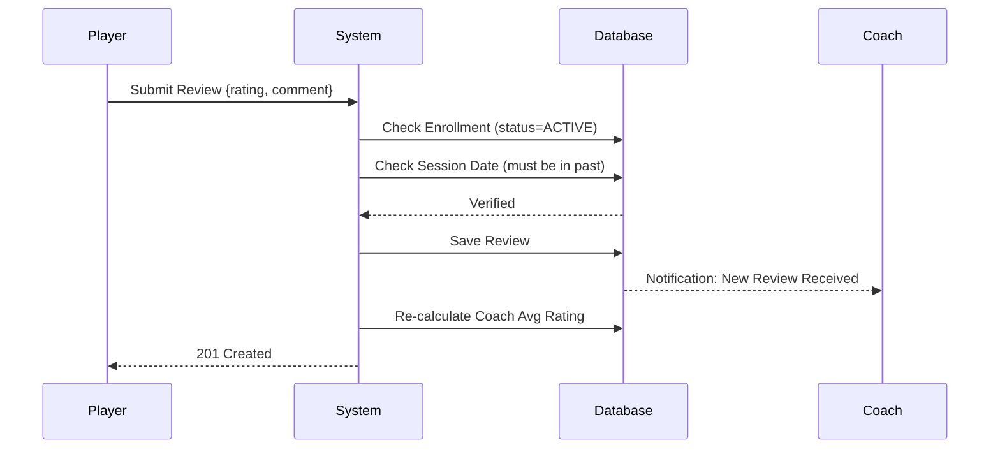

# Review & Rating System

## Overview
The Review System fosters trust and quality within the Coaching Arena. It provides a feedback loop where students can rate their experience and coaches can gain reputation based on their teaching performance.

## Feedback Loop Process

The following sequence ensures that only verified students can leave feedback:



## Technical Implementation

### 1. Data Integrity
- **One-per-Class Rule**: A composite unique constraint `(player_id, masterclass_id)` prevents a single student from spamming multiple reviews for one class.
- **Verification Middleware**:
  ```typescript
  const enrollment = await enrollmentRepo.findOne({
      where: { player_id, masterclass_id, status: 'active' }
  });
  if (!enrollment) throw new Error("Only enrolled students can review this class.");
  ```

### 2. Rating Aggregation
Average ratings are calculated on-the-fly or stored on the `User` (Coach) entity for performance:
```sql
SELECT AVG(rating) as average_rating, COUNT(*) as review_count
FROM reviews WHERE coach_id = :id
```

## Business Rules

- **Completed Sessions Only**: Students can only leave reviews once the masterclass session time has passed. This ensures feedback is based on the actual coaching experience.
- **Star Rating System**: 1 to 5 stars, where 5 is excellent.
- **Review Moderation**: Admins have the authority to flag and remove reviews that violate community guidelines (e.g., hate speech or spam).

## UI/UX Integration
- **Stars Widget**: A custom React component for intuitive rating selection.
- **Testimonial Feed**: Reviews are displayed on both the Masterclass detail page and the Coach's public profile to assist other students in their decision-making.

## Future Enhancements
- **Coach Responses**: Allowing coaches to reply to reviews to address feedback or thank students.
- **Sentiment Analysis**: (Experimental) Using basic NLP to identify common themes in text reviews (e.g., "Great for beginners", "Excellent PGN materials").
