# Search & Filtering System

## Overview
The Search & Filtering System is designed for low-latency discovery of masterclasses. It leverages TypeORM's `QueryBuilder` to generate dynamic, optimized SQL queries that allow users to drill down into the platform's content.

## Query Architecture

The system uses a centralized filtering method in `masterclass.service.ts` that builds the SQL query based on provided parameters:

```mermaid
graph LR
    Input[User Filters] --> Builder[QueryBuilder]
    Builder --> Base[Base Query: Approved Coaches Only]
    Base --> Search[Text Search: Title/Desc ILIKE]
    Search --> Category[Category: Enum Match]
    Category --> Date[Date Range: session_date]
    Date --> Availability[Availability: seats_remaining > 0]
    Availability --> Pagination[Skip/Take + OrderBy]
    Pagination --> SQL[Executed SQL]
```



## Technical Implementation

### 1. Dynamic SQL Generation
The backend doesn't use hardcoded strings. Instead, it builds the query conditionally:

```typescript
const qb = masterclassRepo.createQueryBuilder('mc')
    .leftJoinAndSelect('mc.coach', 'coach')
    .where('coach.is_approved = :approved', { approved: true });

if (filters.search) {
    qb.andWhere('(mc.title ILIKE :search OR mc.description ILIKE :search)', 
               { search: `%${filters.search}%` });
}
```

### 2. Advanced Availability Filter
Calculating "Available Seats" at the SQL level ensures that pagination remains accurate. We use a subquery to compare `capacity` with the count of `ACTIVE` enrollments:

```sql
AND mc.capacity > (
    SELECT COUNT(*) FROM enrollments e 
    WHERE e.masterclass_id = mc.id AND e.status = 'active'
)
```

### 3. Performance & Optimization
- **Indexing**: Database indexes are applied to `session_date`, `category`, and `coach_id` for fast filtering.
- **Full-Text Search**: Currently using `ILIKE` for keyword matching. For larger datasets, an upgrade to PostgreSQL `tsvector` is planned.
- **Caching**: The search results for common queries (e.g., "Trending Openings") are cached in **Redis** for 5 minutes to reduce database load.

## Filter Parameters

| Parameter | Type | Logic |
| :--- | :--- | :--- |
| `search` | String | Case-insensitive keyword search in title/desc. |
| `category` | Enum | Match against `OPENING`, `MIDDLEGAME`, `ENDGAME`, `TACTICS`. |
| `dateFrom / dateTo` | ISO Date | Filter sessions within a specific time window. |
| `available` | Boolean | If true, hides full classes and past sessions. |
| `sortBy` | String | Sort by `date` (chronological) or `created` (newest). |
| `limit` | Number | Page size (default: 9). |

## UI/UX Integration
- **Live Search**: Debounced inputs on the frontend trigger API calls as the user types.
- **Empty States**: The system returns a structured response including `total_pages` and `current_page`, allowing the React frontend to render empty states or "No results found" messages gracefully.
